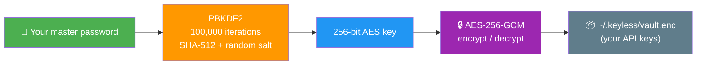
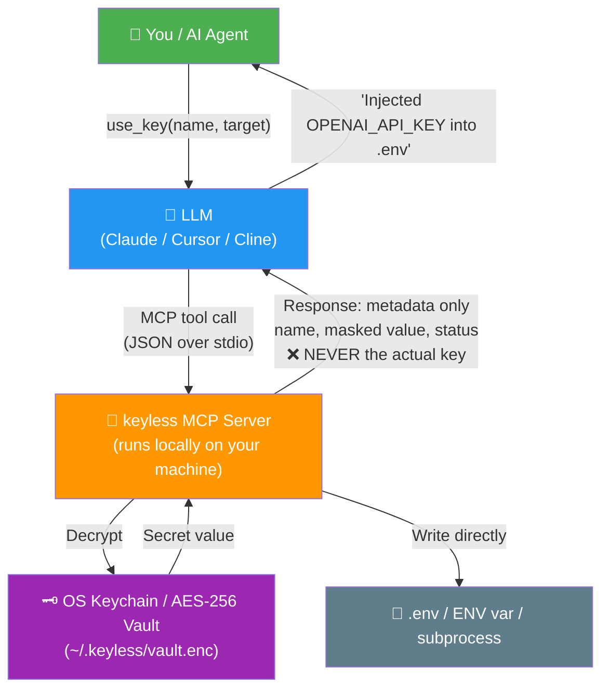
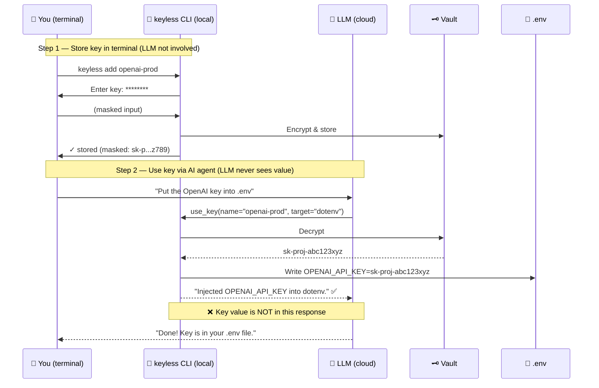
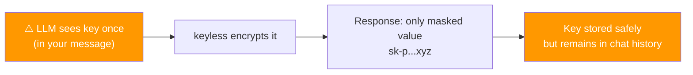

# keyless

Local API key manager for AI coding agents.
Store secrets safely. Expose MCP tools that never leak values to LLMs.

> Like a password manager, but for your API keys — and your AI agent can use them without ever seeing them.

## The Problem

```diff
# .env — every AI agent can read this
- OPENAI_API_KEY=sk-proj-abc123...
- ANTHROPIC_API_KEY=sk-ant-xyz789...
- GITHUB_TOKEN=ghp_a1b2c3d4...

# keyless — agents use keys without seeing values
+ keyless add openai-prod    # encrypted in OS keychain
+ keyless use openai-prod    # injected directly, never in chat
```

Your `.env` file is an open book. Any AI coding agent with file access can read every secret in it. Copy-paste accidents happen. Keys end up in prompts, logs, and conversation history.

keyless solves this by storing keys in your OS keychain (or an encrypted vault) and exposing MCP tools that inject keys directly into the environment — the actual value never appears in any LLM response.

## Quick Start

```bash
# Install
npm install -g keyless

# Initialize (detects OS keychain automatically)
keyless init

# Store a key (provider auto-detected)
keyless add openai-prod
# Paste your key when prompted — it's encrypted immediately

# Use it — value goes straight to .env, never printed
keyless use openai-prod --dotenv
```

## MCP Server Setup

### Step 1: Set your Master Password

keyless uses **AES-256-GCM** encryption to protect your API keys locally. You need to set a master password — this is the "key to your vault":



The master password is passed via the `KEYLESS_MASTER_PASSWORD` environment variable in the MCP server config. It **never** leaves your machine — it's only used locally to encrypt and decrypt your vault.

> **Important**: If you lose the master password, you cannot recover your stored keys. Choose something memorable but secure.

### Step 2: Register as MCP Server

#### Claude Code (global — all projects)

Add to `~/.claude.json` (note: **not** `~/.claude/settings.json`):

```json
{
  "mcpServers": {
    "keyless": {
      "type": "stdio",
      "command": "node",
      "args": ["/path/to/keyless/packages/keyless/dist/mcp.js"],
      "env": {
        "KEYLESS_MASTER_PASSWORD": "your-master-password-here"
      }
    }
  }
}
```

> **Tip**: If you already have other MCP servers in `~/.claude.json`, just add the `"keyless": {...}` block inside the existing `"mcpServers"` object.

#### Cursor

Add to `.cursor/mcp.json`:

```json
{
  "mcpServers": {
    "keyless": {
      "type": "stdio",
      "command": "node",
      "args": ["/path/to/keyless/packages/keyless/dist/mcp.js"],
      "env": {
        "KEYLESS_MASTER_PASSWORD": "your-master-password-here"
      }
    }
  }
}
```

#### Cline

Add to Cline MCP settings:

```json
{
  "mcpServers": {
    "keyless": {
      "type": "stdio",
      "command": "node",
      "args": ["/path/to/keyless/packages/keyless/dist/mcp.js"],
      "env": {
        "KEYLESS_MASTER_PASSWORD": "your-master-password-here"
      }
    }
  }
}
```

### Step 3: Restart your AI agent

Restart Claude Code / Cursor / Cline. Verify keyless is connected:

- Claude Code: run `/mcp` to see keyless and its 7 tools
- Cursor: check MCP panel in settings
- Cline: check MCP server status

### Storage backends

keyless auto-detects the best storage for your platform:

| Platform | Primary Backend | Fallback |
|----------|----------------|----------|
| macOS | Keychain (no password needed) | AES-256-GCM vault |
| Linux (Desktop) | libsecret / GNOME Keyring | AES-256-GCM vault |
| Linux (WSL / headless) | — | AES-256-GCM vault |
| Windows | Credential Manager | AES-256-GCM vault |

On macOS/Linux with a desktop keychain, `KEYLESS_MASTER_PASSWORD` is only needed as fallback. On WSL and headless servers, the AES-256 vault is always used.

## How It Works



The key value flows from the keychain directly to the target (`.env` file or environment variable). It **never** passes through the LLM conversation. MCP tool responses only contain metadata: name, provider, masked value, status.

## Usage Examples

### Recommended: Store keys via CLI, use keys via AI agent

This is the **most secure** workflow. The LLM never touches the key value at any point:



**Step 1: Store via CLI** (in your terminal, not in AI chat):

```bash
# Local build
node /path/to/keyless/packages/keyless/dist/cli.js add openai-prod
# Enter key: ******** (masked — even you can't see it)
# ✓ Key "openai-prod" stored (provider: openai, env: OPENAI_API_KEY)
```

**Step 2: Use via AI agent** (talk naturally):

```
You: "Put the OpenAI key into .env"
You: "Run pytest, use the OpenAI key"
You: "List my API keys"
```

The LLM only knows the key **name**, never the value.

### Alternative: Store via AI agent (convenient, less secure)

You can also paste a key directly in chat:

```
You: "Store this key: sk-proj-abc123xyz"
```



> **Warning**: The key value stays in your **conversation history** for the current session. The LLM can see it in previous messages. After storing, start a new session for maximum security.

### Common AI agent workflows

```
You: "List my API keys"         → LLM calls list_keys → sees names + masked values only
You: "Run pytest with OpenAI"   → LLM calls use_key, then runs pytest
You: "Any keys expiring soon?"  → LLM calls check_expiry → sees expiry dates
You: "Delete the old GitHub PAT"→ LLM calls remove_key
```

### Security comparison

| Method | LLM sees key? | Recommended |
|--------|:---:|:---:|
| **CLI** `keyless add` → AI `use_key` | **Never** | **Yes** |
| Chat `"store sk-..."` → AI `use_key` | Once (in history) | For convenience only |
| Paste in `.env` directly | Depends on agent file access | No |

## Why

- **Keys in `.env` are visible to agents** — any tool with file access can read them and they end up in conversation context
- **Copy-paste is dangerous** — keys pasted into chat persist in conversation history and logs
- **No standard for agent key management** — agents lack a secure way to use secrets without seeing them
- **Expiry tracking** — know which keys are about to expire before your CI breaks
- **Audit trail** — see exactly when and how each key was accessed
- **Provider auto-detection** — paste a key and keyless identifies the provider, sets the right env var name

## CLI Reference

| Command | Description |
|---|---|
| `keyless init` | Initialize keyless (setup keychain backend) |
| `keyless add <name>` | Store a new API key or PAT |
| `keyless list` | List stored keys (metadata only) |
| `keyless use <name>` | Inject a key into env var or .env file |
| `keyless remove <name>` | Delete a stored key |
| `keyless rotate <name>` | Replace a key with a new value |
| `keyless import <file>` | Import keys from a .env file |
| `keyless audit` | View access audit log |
| `keyless check-expiry` | Check for expiring keys |
| `keyless serve` | Start MCP server (stdio transport) |

### Common Flags

| Flag | Commands | Description |
|---|---|---|
| `--backend <type>` | `init` | Force backend: `keychain` or `file` |
| `--state-dir <path>` | `init` | Override state directory |
| `-t, --type <type>` | `add` | Key type: `api_key`, `pat`, `oauth_token`, `ssh_key`, `custom` |
| `-p, --provider <name>` | `add`, `list` | Provider name (auto-detected for `add`) |
| `-e, --env-var <name>` | `add` | Environment variable name |
| `--tags <tags>` | `add` | Comma-separated tags |
| `--expires <date>` | `add` | Expiration date (ISO 8601) |
| `--from-env <var>` | `add` | Read value from environment variable |
| `--stdin` | `add` | Read value from stdin |
| `--dotenv [path]` | `use` | Write to .env file |
| `--exec <cmd...>` | `use` | Run command with key injected |
| `--shell` | `use` | Print export statement |
| `--json` | `list` | Output as JSON |
| `--expired` | `list` | Show only expired keys |
| `--force` | `remove` | Skip confirmation |
| `--key <name>` | `audit` | Filter audit log by key name |
| `--action <type>` | `audit` | Filter audit log by action |
| `--limit <n>` | `audit` | Max audit entries (default: 20) |
| `--days <n>` | `check-expiry` | Threshold days (default: 30) |

## MCP Tools

| Tool | Returns Value? | Description |
|---|---|---|
| `list_keys` | Never | List all stored keys with metadata (name, provider, masked value, tags) |
| `add_key` | Never | Store a new key. Value is encrypted immediately. |
| `use_key` | Never | Inject a key into env or .env. Value goes directly to target. |
| `remove_key` | Never | Permanently delete a stored key. Requires `confirm=true`. |
| `rotate_key` | Never | Replace a key with a new value. Old value is overwritten. |
| `check_expiry` | Never | Check for keys expiring within a threshold (default: 30 days) |
| `audit_log` | Never | Query the audit log for key operations |

Every tool response passes through a response guard (`guards.ts`) that scans for known API key patterns and redacts them. This is the last line of defense against accidental leakage.

## Security Model

keyless is designed around a single principle: **key values never reach the LLM**.

- Tool responses contain only metadata (name, provider, masked value)
- A response guard scans all MCP output for known key patterns and redacts matches
- Keys are stored in the OS keychain (preferred) or an AES-256-GCM encrypted vault
- Every key operation is recorded in an append-only audit log
- `add_key` and `rotate_key` responses instruct the LLM to forget the raw value

For the full threat model and security details, see [SECURITY.md](./SECURITY.md).

## Agent Skill

Install as an agent skill for automatic key management:

```bash
npx skills add larry610881/keyless
```

The skill teaches agents to:
1. Use `list_keys` to discover available keys
2. Use `use_key` to inject keys before running commands
3. Never repeat key values in responses
4. Refer to keys only by name after storing

See [skills/keyless/SKILL.md](./skills/keyless/SKILL.md) for the full skill definition.

## Configuration

| Environment Variable | Default | Description |
|---|---|---|
| `KEYLESS_MASTER_PASSWORD` | `""` | Master password for AES-256-GCM vault encryption. **Required** on WSL/headless Linux. Set this in your MCP server config `env` block. |
| `KEYLESS_STATE_DIR` | `~/.keyless` | Directory for index, vault, audit log, and config |
| `KEYLESS_BACKEND` | `auto` | Storage backend: `keychain`, `file`, or `auto` |
| `KEYLESS_AUDIT` | `true` | Set to `false` to disable audit logging |

The state directory contains:

| File | Purpose |
|---|---|
| `config.json` | Backend preference, audit settings |
| `index.json` | Key metadata (no secret values) |
| `vault.enc` | AES-256-GCM encrypted secrets (file backend only) |
| `audit.jsonl` | Append-only operation log |

## Supported Providers

keyless auto-detects the provider when you add a key by matching the value against known patterns:

| Provider | Pattern | Default Env Var |
|---|---|---|
| OpenAI | `sk-proj-...`, `sk-...` | `OPENAI_API_KEY` |
| Anthropic | `sk-ant-...` | `ANTHROPIC_API_KEY` |
| GitHub | `ghp_...`, `gho_...`, `github_pat_...` | `GITHUB_TOKEN` |
| GitLab | `glpat-...` | `GITLAB_TOKEN` |
| AWS | `AKIA...` | `AWS_ACCESS_KEY_ID` |
| Vercel | `vercel_...` | `VERCEL_TOKEN` |
| Hugging Face | `hf_...` | `HF_TOKEN` |
| xAI | `xai-...` | `XAI_API_KEY` |
| Groq | `gsk_...` | `GROQ_API_KEY` |

Keys that don't match any pattern are stored with provider `unknown` and the env var is derived from the key name.

## Development

```bash
git clone https://github.com/larry610881/keyless.git
cd keyless
npx pnpm@9.15.4 install
npx pnpm@9.15.4 build
npx pnpm@9.15.4 test
```

The project is a pnpm monorepo managed with Turborepo:

```
keyless/
  packages/
    keyless/          # Core library, CLI, and MCP server
  skills/
    keyless/          # Agent skill definition
  tests/              # Integration tests
```

## License

[MIT](./LICENSE)
